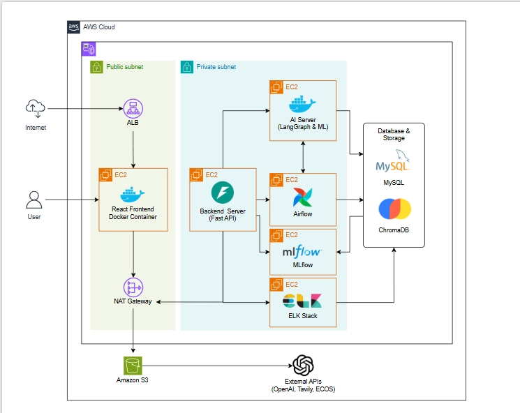
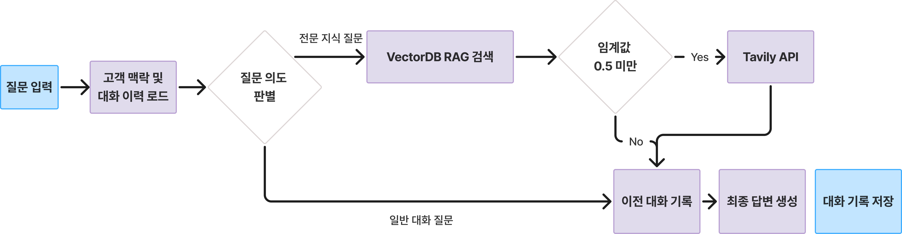

# [우리FISA 6기] AI 엔지니어링 과정 1팀 (프로젝트 Submit.md)

## 연관 레포지토리

| 레포 | 역할 |
|---|---|
| [POOM-BACK](https://github.com/PoomSaengPoomSa/POOM-BACK) | FastAPI 백엔드 서버 |
| [POOM-FRONT](https://github.com/PoomSaengPoomSa/POOM-FRONT) | React 프론트엔드 |
| [POOM-AI](https://github.com/PoomSaengPoomSa/POOM-AI) | LangGraph 멀티 에이전트 |
| [POOM-AIRFLOW](https://github.com/PoomSaengPoomSa/POOM-AIRFLOW) | Airflow 서버 및 Dags |
| [POOM-MLFLOW](https://github.com/PoomSaengPoomSa/POOM-MLFLOW) | MLflow 서버 |
| [POOM-ELK](https://github.com/PoomSaengPoomSa/POOM-ELK) | ELK 서버 |


## 1. 프로젝트 개요

* **주제** : POOM: PB(Private Banker)를 위한 AI Assistant (생성형 AI 기반 스마트 워크 에이전트-대직원 서비스)
* **프로젝트 기획 배경** :
    * 현장 멘토링 과정 중 **금융 닥터**와의 이야기를 통해 고액자산가의 자산을 관리하는 **PB**를 알게 되었습니다. 
    * PB에 대해 추가 조사를 한 바, 최근 은행 영업점의 역할이 축소되는 반면, 수익 기여도가 높은 고액 자산가를 위한 **PB 서비스의 중요성은 커지고 있습니다.**
    * 그러나 **은행의 고객 관리 부재**로 인한 이탈률이 62.8%에 달할 정도로 고객 관리 시스템에 한계가 존재합니다. 
    * PB는 **상담 업무 외에도 시황 파악, 고객 이탈 징후 체크** 등 복잡하고 반복적인 업무를 수행하느라 고객을 깊이 이해하고 관리할 **시간이 부족합니다.**
    * 또한 PB가 상담을 통해 누적한 **정량적, 정성적 정보**를 후임자에게 전달할 방법이 부족하다는 사실을 **현직자와의 인터뷰**를 통해 알게 되었습니다. 
    * 이에 따라 PB의 '품(노동력)'을 덜어주고, 고객의 마음을 따뜻하게 '품어주는' 맞춤형 AI 어시스턴트 서비스인 '**POOM**'을 기획하게 되었습니다.


* **기술 스택** :
    * **Frontend & Backend**: React, FastAPI, Python
    * **AI Agent & LLM**: OpenAI, LangChain, LangGraph, LangSmith, Tavily
    * **ML & XAI**: scikit-learn, XGBoost, CatBoost, SHAP
    * **Data Pipeline & MLOps**: Apache Airflow, MLflow
    * **DevOps & Infra**: AWS, GitHub Actions, Docker
    * **Database & Storage**: MySQL, Chroma, Amazon S3, ELK Stack (Elasticsearch, Logstash)
    * 교육 과정에서 배운 모든 스택을 최대한 활용해보고자 하였습니다. 


## 2. 아키텍쳐

### 2-1. 시스템 아키텍쳐


### 설명

사용자가 React 기반 Frontend를 통해 HTTP 요청을 보내면 AWS 환경의 Backend Server와 통신합니다. Backend는 LangGraph 기반의 AI Server로 작업을 넘기며, AI Server는 OpenAI, Tavily 등 외부 API와 통신하여 데이터를 처리합니다. 각종 데이터는 MySQL, ChromaDB, Amazon S3 및 Elasticsearch에 저장되며, ML 모델 관리를 위해 Airflow와 MLflow 파이프라인이 유기적으로 연결되어 동작합니다.

### 서버 아키텍처


### 설명

본 시스템은 AWS VPC 환경 내에서 퍼블릭/프라이빗 서브넷을 철저히 격리하여 보안성을 극대화한 클라우드 네이티브 아키텍처입니다. 클라이언트 트래픽은 AWS ALB를 통해 프라이빗 망의 FastAPI 백엔드 및 LangGraph AI 서버로 안전하게 분산되며, 외부 API 연동은 NAT Gateway로 통제됩니다. 데이터는 MySQL, Chroma DB, Amazon S3에 목적별로 분산 저장되고, Apache Airflow 기반의 MLOps와 ELK 스택 로깅 파이프라인이 유기적으로 통합되어 안정적인 AI 서비스를 제공합니다.

### 2-2. AI 에이전트 워크플로우 (AI 엔지니어링 과정만 해당)
### 2-2-1 AI 전체 워크플로우


### 설명

시스템 내에는 총 6개의 주요 Agent 및 LLM이 동작합니다. '고객 분석 Agent(Main)'가 분석 대상을 선별하고 서브 에이전트를 동적으로 라우팅합니다. 이 결과를 바탕으로 'AI To-Do Agent'가 PB의 캘린더에 일정을 적재하며, '방문 브리핑 LLM', '시뮬레이션 Agent', '메모 구조화 LLM' 등이 상담 전후의 업무를 자동화하고 구조화하여 DB에 저장하는 파이프라인으로 구성되어 있습니다.

### 2-2-2 고객 분석 Agent 워크 플로우


### 2-2-3 시뮬레이션 Agent 워크 플로우


### 2-2-4 특징 추출 Agent 워크 플로우


### 2-2-5 AI TODO Agent 워크 플로우


## 3. 주요 기능 소개

### 3-1. 핵심 기술 구성

1. **Orchestrator-Workers 에이전트 (고객 분석 Agent)**: 모든 고객을 분석하는 대신 Main Agent가 사전에 대상을 추출한 뒤, 필요한 Sub Agent만 동적으로 분기시켜 실행합니다. 이를 통해 개인별 맞춤형 분석을 제공하고 토큰 소모량을 대폭 감소시켰습니다.
2. **멀티쿼리 분할 기반 하이브리드 RAG (시뮬레이션 Agent)**: LLM이 쿼리를 자율적으로 분석 및 분할하여 다중 서브 쿼리로 변환하고, 벡터DB 매칭과 실시간 웹 검색(Tavily)을 혼합하여 검색 정확도를 개선했습니다.
3. **XAI 기반 경제지표 예측 및 자동 보고서 파이프라인**: 거시경제 데이터를 기반으로 예측 모델을 구축하고, SHAP 기술을 적용하여 변수 기여도를 수치화한 뒤 LLM을 통해 자연어 심층 분석 보고서로 자동 생성합니다.

### 3-2. 통합 워크플로우 다이어그램


### 3-3. 세부 기능 소개

#### [AI 고객 분석]

* **기능 설명** : 배치 타겟 셀렉터가 분석 후보군을 선별하면, Main Agent가 고객의 현황과 거래 정보를 바탕으로 LLM 라우팅을 수행합니다. 판단 결과에 따라 자산 분석(Sub 1), 이탈 위험(Sub 2), 상품 매칭(Sub 3) 에이전트를 동적으로 취사선택하여 구동시킵니다.
* **핵심 코드(스크립트)** :
```python
# LLM 라우터 구동을 위한 프롬프트 바인딩 및 서브 에이전트 동적 의사결정
llm = ChatOpenAI(model=DEFAULT_MODEL, temperature=0.1, api_key=OPENAI_API_KEY)
structured_llm = llm.with_structured_output(SubAgentRouting)
prompt = ChatPromptTemplate.from_messages([
    ("system", system_prompt),
    ("user", "{user_content}")
])
chain = prompt | structured_llm
routing: SubAgentRouting = chain.invoke({"user_content": user_prompt})

# 3. 판정에 따른 선택적 서브 에이전트 샌드박스 구동
if routing.run_asset_insight:
    self.sub1.run(customer_id)  # Sub Agent 1: 자산 리밸런싱 인사이트
if routing.run_churn_risk:
    self.sub2.run(customer_id)  # Sub Agent 2: 이탈 위험 수준 분석
if routing.run_product_matching:
    self.sub3.run(customer_id)  # Sub Agent 3: 주력 금융 상품 적합성 평가

```


* **코드 링크(스크립트 링크)** : `poomsaengpoomsa/poom-ai/agent/customer-main-agent/customer_agent/main_agent.py`


#### [AI To-Do]

* **기능 설명** : 분석된 고객 데이터를 바탕으로 PB의 최적 일정을 기획(Planner)하고 실행(Executor)합니다. 평가(Evaluator) 단계에서 일정이 충돌하거나 문제가 있으면 반성(Reflection) 단계로 돌아가 계획을 수정하는 재귀적 워크플로우를 가집니다.
* **핵심 코드(스크립트)** :
```python
# LangGraph 기반 AI To Do Agent 워크플로우 생성
workflow = StateGraph(AgentState)
# 노드 등록 (상태분석 ➔ 목표수립 ➔ 계획 ➔ 실행 ➔ 평가 ➔ 반성)
workflow.add_node("state_analyzer", state_analyzer_node)
workflow.add_node("goal_selector", goal_selector_node)
workflow.add_node("planner", planner_node)
workflow.add_node("executor", executor_node)
workflow.add_node("evaluator", evaluator_node)
workflow.add_node("reflection", reflection_node)
# 워크플로우 진입점 설정 및 초기 엣지 연결
workflow.set_entry_point("state_analyzer")
workflow.add_edge("state_analyzer", "goal_selector")
workflow.add_edge("goal_selector", "planner")
# 계획에서 실행, 실행에서 평가 노드로 연결
workflow.add_edge("planner", "executor")
workflow.add_edge("executor", "evaluator")
# Evaluator 이후 조건부 라우팅 설정 (검증 실패 시 reflection 전이)
workflow.add_conditional_edges(
    "evaluator",
    condition_check,
    {
        "end": END,
        "reflection": "reflection" # 추천 일정 충돌 시 반성 노드로 라우팅
    }
)
# Reflection(반성) 완료 후 다시 Planner로 전이하여 교정된 계획 수립 (재귀)
workflow.add_edge("reflection", "planner")
return workflow.compile()
```


* **코드 링크(스크립트 링크)** : `poomsaengpoomsa/poom-ai/agent/todo/graph/graph_builder.py`

#### [AI 상담 보조 및 메모 어시스턴트]

* **기능 설명** : 고객 방문 전 요약 브리핑 리포트를 생성하고, 상담 전에는 시뮬레이터가 하이브리드 RAG 검색을 통해 세일즈 팁을 제공합니다. 상담 중과 후에는 남긴 메모는 구조화 LLM을 통해 DB에 정형 데이터로 자동 저장되며, 고객의 특징과 키워드가 지식 베이스로 추출됩니다.
* **핵심 코드(스크립트)** :

```python
# 1. [상담 전] 고객 정보 종합 및 방문 예정 브리핑 자동 생성 (visit_brief_generator.py)
completion = client.chat.completions.create(
    model="gpt-4o-mini",
    messages=[
        {"role": "system", "content": "당신은 우량 고객 자산관리 비서 전문가입니다. 항상 정해진 마커 포맷으로 정밀하고 개별화된 보고서를 반환합니다."},
        {"role": "user", "content": prompt} # 자산, 거래내역, 최근 메모 등 통합 정보
    ],
    temperature=0.3
)
briefing_text = completion.choices[0].message.content

# 2. [상담 중] 의도 파악 및 하이브리드 RAG 시뮬레이터 워크플로우 (simulator.py)
workflow = StateGraph(SimulatorState)

workflow.add_node("load_context", load_context_node)
workflow.add_node("route_intent", route_intent_node)
# knowledge_node: VectorDB 매칭 + Tavily 웹 검색 폴백 + 실시간 상품 DB 통합
workflow.add_node("knowledge", knowledge_node) 
workflow.add_node("generate_answer", generate_answer_node)

# 대화 의도(intent)에 따라 지식 검색 여부를 동적으로 라우팅
workflow.add_conditional_edges(
    "route_intent",
    route_conditional_edge,
    {
        "knowledge": "knowledge",
        "generate_answer": "generate_answer"
    }
)

```

* **코드 링크(스크립트 링크)** :
* `poomsaengpoomsa/poom-ai/llm/visit_brief/visit_brief_generator.py`
* `poomsaengpoomsa/poom-ai/agent/simulator/simulator.py`
* `poomsaengpoomsa/poom-ai/agent/feature/feature_agent.py`


#### [ML, XAI 기반 시장 분석 인사이트]

* **기능 설명** : 거시경제 지표 및 금값 등의 금융 데이터를 기반으로 머신러닝 예측 모델을 구동하고, SHAP(SHapley Additive exPlanations) 기법을 활용해 각 변수가 예측에 미친 영향도(가중치, 오분류 케이스, Beeswarm 등)를 분석합니다. 이후 도출된 XAI 데이터를 LLM에 입력하여, 단순 수치 예측을 넘어 경제학적 관점의 심층 분석 리포트와 요약을 자동 생성해 대시보드에 제공합니다.
* **핵심 코드(스크립트)** :

```python
# SHAP 분석 결과(Feature Importance, 오분류, Beeswarm 등)를 LLM 프롬프트에 주입하여 경제 해석 리포트 자동 생성
user_content_text = user_xai_template.format(
    csv_text=csv_text,
    misclass_text=misclass_text,
    beeswarm_text=beeswarm_text
)

messages = [
    {"role": "system", "content": system_prompt},
    {"role": "user", "content": [{"type": "text", "text": user_content_text}]}
]

response = client.chat.completions.create(
    model="gpt-4o-mini",
    messages=messages,
    max_tokens=3000,
    temperature=0.3
)
result_text = response.choices[0].message.content.strip()

# 생성된 LLM 분석 리포트 및 요약본을 DB(trend_llm_report)에 저장
save_report_to_mysql(result_text, summary_text, "gold")

```

* **코드 링크(스크립트 링크)** : `poomsaengpoomsa/poom-ai/ml/gold/interpret_xai.py`

#### [AI 고객 특징 및 관계 추출]

* **기능 설명** : 담당 PB 변경 시 발생하는 정성적 정보 누락을 방지하기 위해, 상담 일지 텍스트에서 고객의 세부 특징(성향, 기호, 건강 등)과 인적 네트워크(가족, 지인의 직업 및 기념일 등)를 AI가 구조화하여 자동 추출합니다. LangGraph 워크플로우를 통해 기존 DB의 정보와 비교하여 중복을 제거(Deduplication)하고 지능적으로 병합(Merge)하며, 최근 한 달간의 핵심 키워드를 추출하여 후임자가 고객을 빠르게 파악할 수 있도록 돕습니다.
* **핵심 코드(스크립트)** :

```python
# LangGraph 기반의 고객 특징 및 관계 정보 추출/검증/병합 파이프라인
workflow2 = StateGraph(Agent2State)

workflow2.add_node("load_report", load_report_node)
workflow2.add_node("extract_features", extract_features_node) # 특징 추출
workflow2.add_node("refine_and_deduplicate_features", refine_and_deduplicate_features_node) # LLM 기반 중복 제거 및 ADD/UPDATE/SKIP 판단
workflow2.add_node("extract_relationships", extract_relationships_node) # 가족/지인 관계 및 기념일 추출
workflow2.add_node("validate_relationships", validate_relationships_node) # 환각 방지 및 제약조건 검증
workflow2.add_node("extract_keywords", extract_keywords_node) # 워드클라우드용 요약 키워드 추출

# Branch 1: 고객 특징(Feature) 파이프라인
workflow2.add_edge("extract_features", "refine_and_deduplicate_features")
workflow2.add_edge("refine_and_deduplicate_features", "save_features")

# Branch 2: 고객 관계(Relationship) 파이프라인
workflow2.add_edge("extract_relationships", "validate_relationships")
workflow2.add_edge("validate_relationships", "save_relationships")

compiled_app2 = workflow2.compile()

```

* **코드 링크(스크립트 링크)** : `poomsaengpoomsa/poom-ai/agent/feature/feature_agent.py`
